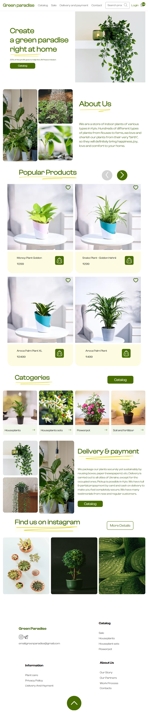

# SAW - Your Ultimate Tech Haven

## Table of Contents

1. [Description](#description)
2. [Demo](#demo)
3. [Features](#features)
4. [Screenshots](#screenshots)
5. [Contributors](#contributors)

## Description

SAW Electronics is your go-to online store for all your electronic needs. We offer a vast selection of the latest gadgets, devices, and accessories, providing tech enthusiasts with a paradise of choices. Our platform is designed with user convenience in mind, ensuring a seamless shopping experience for customers looking to upgrade their tech game. Built using cutting-edge technologies such as HTML, CSS, and JavaScript, SAW Electronics is your ultimate destination for high-quality electronics.

## Demo

- [Live Demo](https://green-paradise-electronics.netlify.app)

## Features

- **Extensive Product Range:** Explore a diverse range of electronics, from smartphones and laptops to smart home devices and accessories.
- **Detailed Product Information:** Access comprehensive product descriptions, specifications, and customer reviews to make informed purchase decisions.
- **Easy Navigation:** Intuitive search and navigation features help you find products quickly and effortlessly.
- **Secure Shopping:** Shop with confidence using our secure checkout process and multiple payment options.
- **Personalized User Accounts:** Create an account to track your orders, save favorite items, and receive personalized recommendations.
- **Responsive Design:** Enjoy a seamless shopping experience on both desktop and mobile devices with our responsive design.

## Screenshots

Check out our user-friendly interface on various devices:

- 
- 
- 
- 

## Contributors

Meet the team behind SAW Electronics:

- **Dipanshu Singh**
  - [LinkedIn](https://www.linkedin.com/in/dipanshu-singh-645821153)
  - [GitHub](https://github.com/Dipanshu-Singh-Dev/)

Thank you for choosing SAW Electronics. Enjoy your tech shopping experience!
